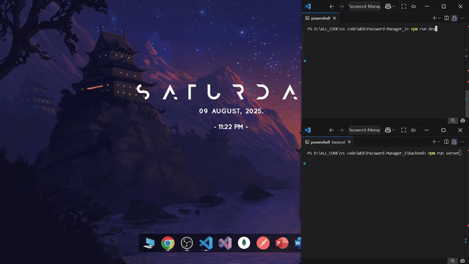
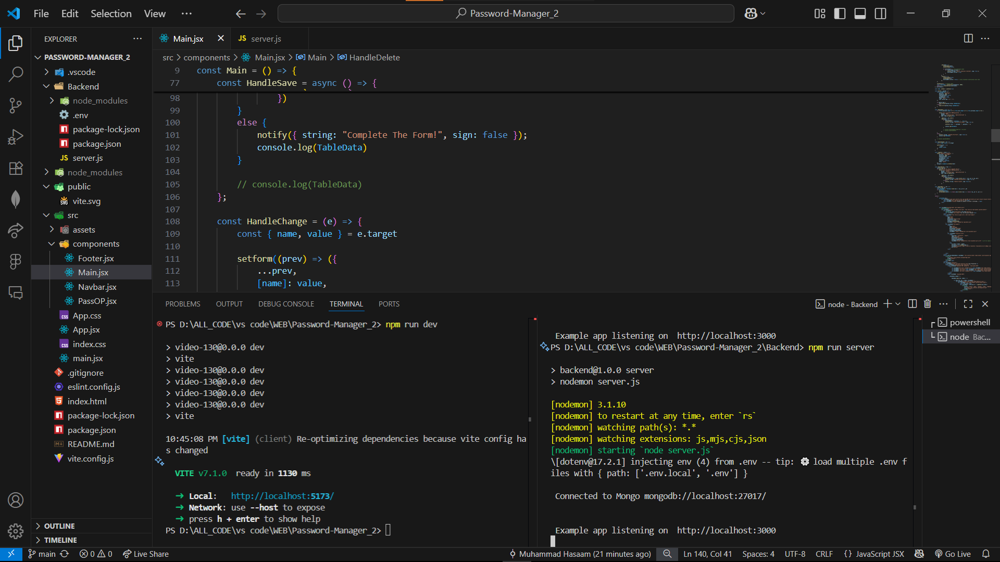
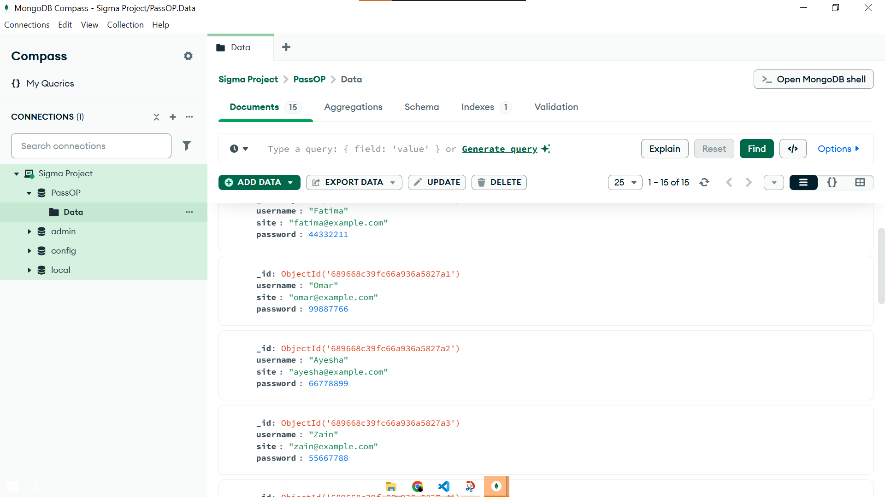

# **Password Manager**


## 📷 **Preview**

<table>
<tr>
<td>
  <!-- Left: Demo GIF -->
  
</td>
<td>
  <!-- Right: VS Code (top) + MongoDB (bottom) -->
  <br>
  
</td>
</tr>
</table>


---

A simple and secure password manager built with **React** (frontend) and **Node.js/Express** (backend).  
This app allows you to store, view, copy, and manage your passwords with a clean UI and responsive design.

---

## 🚀 **Tech Stack**
**Frontend**
- React + Vite
- Tailwind CSS
- React Toastify

**Backend**
- Node.js
- Express
- MongoDB (for storage)

---

## 📂 **Features**
- Add, view, edit, and delete passwords.
- Copy password to clipboard with one click.
- Server connection status notification.
- Responsive design for desktop, tablet, and mobile.

---

## 🛠 **Setup Instructions**
### **1. Clone the repository**
```bash
git clone https://github.com/M-Hasaam/Password_Manager.git
cd Password_Manager
```

### **2. Install dependencies**
**Frontend**
```bash
npm install
```
**Backend**
```bash
cd Backend
npm install
```

### **3. Set up environment variables**
Create a `.env` file inside `Backend/`:
```env
MONGODB_URI=your_mongodb_connection_string
PORT=3000
```

### **4. Run the app**
**Backend**
```bash
cd Backend
node server.js
```
**Frontend**
```bash
npm run dev
```

---
